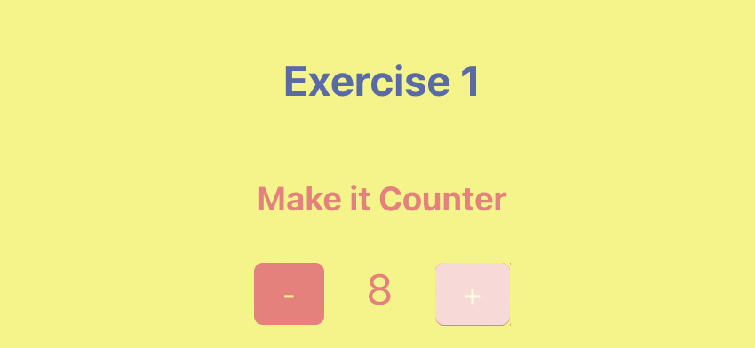
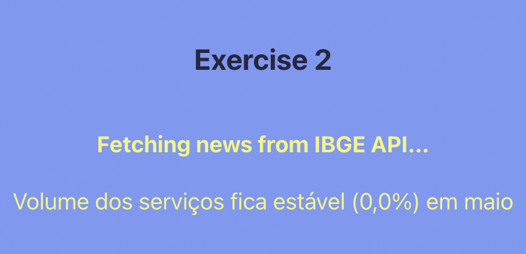
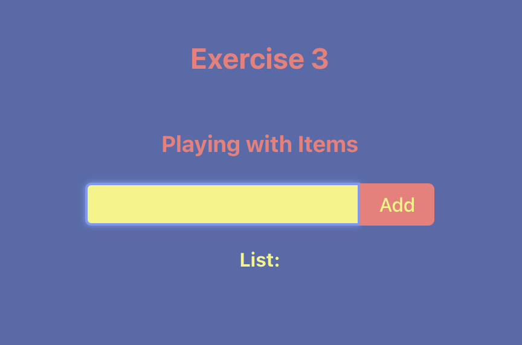
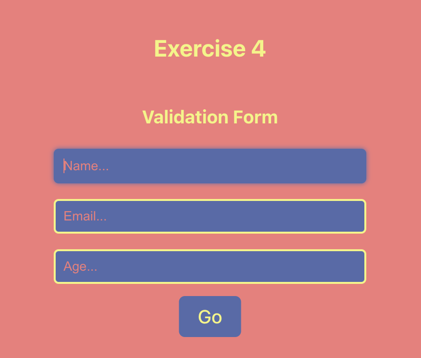
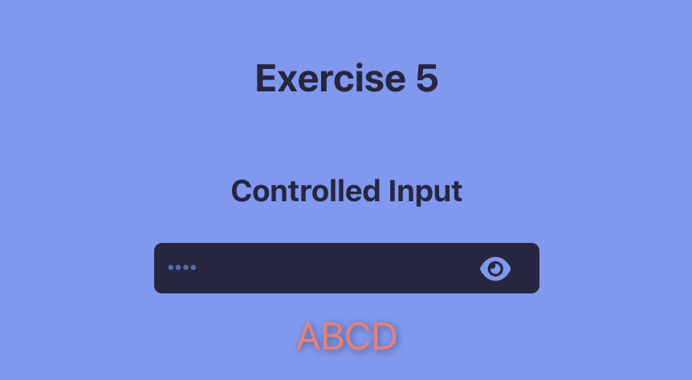
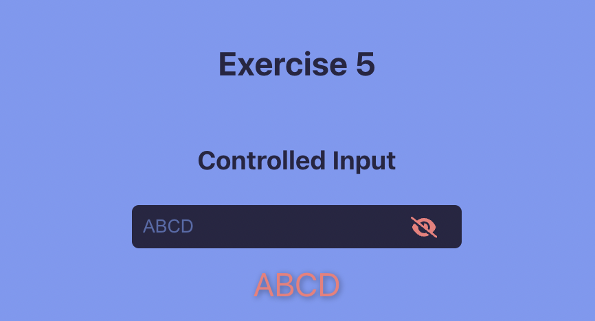

# M2S07

## Exercises using React + Vite: 

Another week full of exercises with Vite and React to practice useState, useEffect, onChange events and controlled components. Plus, some simple CSS animations and icons from react-icons library.

### Technologies

- HTML
- CSS
- JavaScript
- React

---

### Samples

<h4 align="center">

</h4>